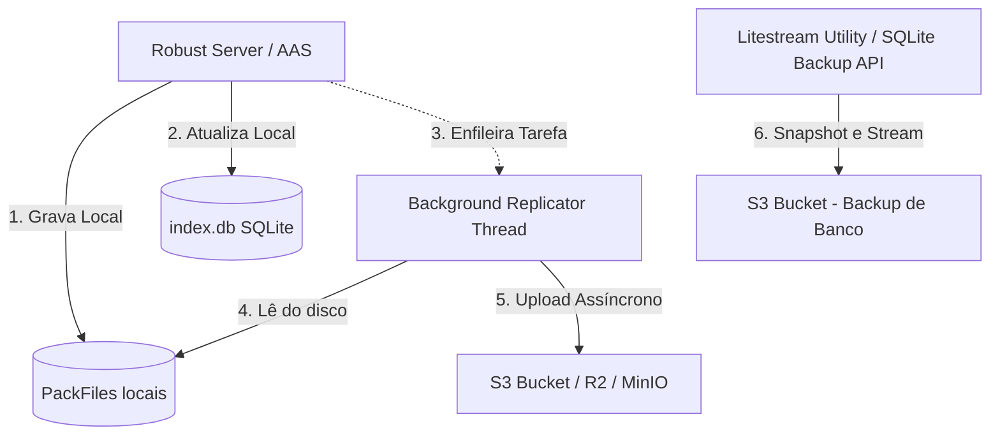

# Advanced Asset Service: Solução de Replicação para Armazenamento S3 (AWS/MinIO/Cloudflare R2)

Este documento descreve a arquitetura e o design para implementar a replicação em segundo plano dos dados do **AdvancedAssetService (AAS)** para serviços de armazenamento de objetos compatíveis com a API S3 da Amazon.

O objetivo principal é garantir **resiliência total contra perda de dados**, permitindo que os assets físicos (arquivos `.bin` do PackFiles) e o banco de índice SQLite (`index.db`) sejam replicados de forma assíncrona para a nuvem sem impactar a performance do simulador em tempo de execução.

---

## 1. O Desafio da Replicação no AAS

O AAS possui dois componentes principais de dados na pasta `asset_packs`:
1. **PackFiles (`.bin`):** Arquivos grandes (ex: 256MB) contendo dados de múltiplos assets concatenados. Eles são essencialmente **append-only** (apenas inclusões de novos bytes no final do arquivo) e tornam-se **somente leitura** assim que atingem o tamanho máximo.
2. **Índice SQLite (`index.db`):** Banco relacional local que mapeia o UUID do asset ao seu PackFile e offset físico. Ele sofre escritas frequentes sob concorrência.

> [!IMPORTANT]
> Uma replicação síncrona (esperar o upload para o S3 completar antes de responder ao visualizador) degradaria severamente o desempenho da grid. Portanto, a replicação **deve ser assíncrona em background**.

---

## 2. Arquitetura Proposta: Replicação Assíncrona Nativa (C# + AWS SDK)

A melhor abordagem é integrar nativamente um módulo de replicação em background no próprio `AdvancedAssetService`.



### Componentes da Solução:

### A. Sincronização dos PackFiles (.bin)
1. **Monitoramento de PackFiles Fechados:** 
   O `PackFileManager` gera arquivos sequenciais (`pack_000001.bin`, `pack_000002.bin`). Quando um packfile é "selado" (atinge o tamanho máximo e um novo é criado), ele entra na fila de uploads garantidos.
2. **Sincronização incremental do PackFile ativo:**
   O arquivo de pacote ativo atualmente pode ser sincronizado em intervalos fixos (ex: a cada 5 minutos) utilizando a funcionalidade de **Multipart Upload** do S3 ou upload incremental por offset para economizar banda.
3. **Módulo de Fila de Uploads (Persistent Sync Queue):**
   Para evitar perda de tarefas caso o Robust seja desligado no meio de um upload, uma tabela simples de fila de tarefas (ex: SQLite `sync_queue` ou MySQL) monitora quais arquivos/partes já foram replicados.

### B. Replicação do Índice SQLite (index.db)
Como o banco SQLite é constantemente atualizado, a cópia direta do arquivo ativo pode resultar em banco corrompido no S3 (devido a travas de escrita do SQLite).
Duas opções viáveis:
1. **SQLite Backup API (Nativo do C#):**
   A cada X minutos, o Robust executa o comando nativo `sqlite3_backup` para criar um arquivo de snapshot íntegro (`index_backup.db`) na pasta de cache e realiza o upload desse arquivo para o S3 de forma atômica.
2. **Replicação por Streaming via Litestream (Ferramenta Externa Recomendada):**
   O **Litestream** é uma ferramenta open-source que roda em background monitorando o arquivo de log WAL (Write-Ahead Log) do SQLite e transmitindo as alterações de páginas físicas segundo a segundo para o S3 de forma extremamente leve e segura.

---

## 3. Estrutura de Configuração no `Robust.ini`

Para habilitar a replicação, estendemos a seção `[AssetService]` do Robust com novos parâmetros dedicados:

```ini
[AssetService]
    ;; ... Configurações existentes do AAS ...

    ;; Habilitar Replicação S3
    EnableS3Replication = true

    ;; Provedor S3 (AWS, Cloudflare R2, MinIO, Wasabi, etc.)
    S3ServiceUrl = "https://<account-id>.r2.cloudflarestorage.com" ; Deixe em branco para AWS nativo
    S3Region = "auto"
    S3BucketName = "oligrid-assets-backup"
    S3AccessKey = "sua_chave_de_acesso_s3"
    S3SecretKey = "sua_chave_secreta_s3"

    ;; Intervalo de sincronização em minutos
    S3SyncInterval = 10

    ;; Habilitar criptografia na nuvem (SSE-S3)
    S3EncryptAtRest = true
```

---

## 4. Projeto do Código: `S3BackgroundReplicator`

Abaixo está o esboço de classe a ser implementada sob `OpenSim.Services.AdvancedAssetService`:

```csharp
using Amazon.S3;
using Amazon.S3.Model;
using System.IO;
using System.Threading;

namespace OpenSim.Services.AdvancedAssetService
{
    public class S3BackgroundReplicator
    {
        private readonly IAmazonS3 m_s3Client;
        private readonly string m_bucketName;
        private readonly string m_storagePath;
        private readonly int m_syncIntervalMs;
        private Timer m_syncTimer;
        private bool m_isSyncing = false;

        public S3BackgroundReplicator(string serviceUrl, string region, string bucket, string accessKey, string secretKey, string storagePath, int intervalMinutes)
        {
            m_bucketName = bucket;
            m_storagePath = storagePath;
            m_syncIntervalMs = intervalMinutes * 60 * 1000;

            AmazonS3Config s3Config = new AmazonS3Config();
            if (!string.IsNullOrEmpty(serviceUrl))
            {
                s3Config.ServiceURL = serviceUrl;
            }
            else
            {
                s3Config.RegionEndpoint = Amazon.RegionEndpoint.GetBySystemName(region);
            }

            m_s3Client = new AmazonS3Client(accessKey, secretKey, s3Config);
        }

        public void Start()
        {
            m_syncTimer = new Timer(ExecuteSync, null, 10000, m_syncIntervalMs);
        }

        private void ExecuteSync(object state)
        {
            if (m_isSyncing) return;
            m_isSyncing = true;

            try
            {
                // 1. Sincroniza PackFiles terminados (.bin)
                string[] binFiles = Directory.GetFiles(m_storagePath, "pack_*.bin");
                foreach (string file in binFiles)
                {
                    string key = "packfiles/" + Path.GetFileName(file);
                    
                    // Verifica se o arquivo já existe no S3 com o mesmo tamanho (evita re-upload)
                    if (!FileAlreadyInS3(key, new FileInfo(file).Length))
                    {
                        UploadFileToS3(file, key);
                    }
                }

                // 2. Faz backup atômico do SQLite index.db
                string backupDbPath = Path.Combine(m_storagePath, "index_backup.db");
                BackupSQLiteIndex(backupDbPath);
                
                // 3. Upload do banco de índice para S3
                UploadFileToS3(backupDbPath, "metadata/index.db");
            }
            catch (System.Exception ex)
            {
                // Log da exceção
            }
            finally
            {
                m_isSyncing = false;
            }
        }

        private void BackupSQLiteIndex(string destinationPath)
        {
            // Executa o comando VACUUM INTO ou backup atômico via driver SQLite csharp
        }

        private void UploadFileToS3(string localPath, string s3Key)
        {
            PutObjectRequest request = new PutObjectRequest
            {
                BucketName = m_bucketName,
                Key = s3Key,
                FilePath = localPath
            };
            m_s3Client.PutObjectAsync(request).Wait();
        }

        private bool FileAlreadyInS3(string s3Key, long localLength)
        {
            try
            {
                var response = m_s3Client.GetObjectMetadataAsync(m_bucketName, s3Key).Result;
                return response.ContentLength == localLength;
            }
            catch
            {
                return false;
            }
        }
    }
}
```

---

## 5. Estratégia de Disaster Recovery (Recuperação de Desastre)

Se o servidor local do Robust queimar completamente e você perder todos os arquivos locais:

1. **Provisionamento do Novo Servidor:** Monte o novo ambiente Robust limpo.
2. **Download do Índice:** Baixe o arquivo `metadata/index.db` do bucket S3 e coloque na pasta `asset_packs`.
3. **Leitura Sob Demanda (Opcional):**
   * *Abordagem Reativa:* Configurar o `AdvancedAssetService` para que, se um arquivo `.bin` requisitado não for encontrado localmente, ele faça o download automático em tempo de execução desse `.bin` específico do S3 e salve no cache local do disco.
   * *Abordagem Proativa:* Rodar um comando de restauro no Robust para baixar todos os arquivos `pack_*.bin` do S3 antes de abrir as regiões.

---

> [!TIP]
> **Recomendação Econômica:** Utilizar o Cloudflare R2 ou Wasabi em vez do AWS S3 padrão. O Cloudflare R2 possui **custo zero de download (egress fees)**, o que significa que se você precisar recuperar gigabytes de assets de backup para reconstruir seu servidor local, não pagará taxas abusivas por tráfego de dados.
