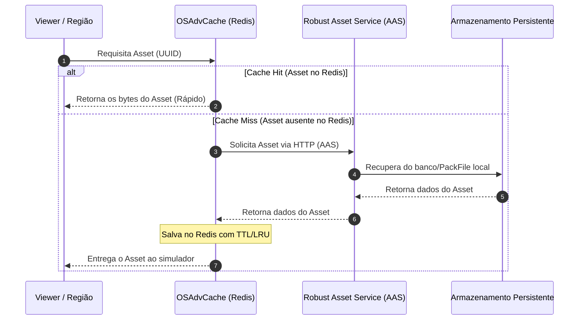

# OSAdvCache: Cache de Assets de Alta Performance Baseado em Redis para OpenSim

Este documento apresenta a análise de viabilidade, o projeto arquitetural e a especificação técnica para a implementação do **OSAdvCache**, um módulo de cache de assets de nível 2 (L2) centralizado baseado em **Redis** para o OpenSim. 

O objetivo principal é eliminar a necessidade de armazenamento em disco individual das instâncias de simuladores (caching local tradicional) e centralizar o cache de leitura em memória de altíssima velocidade, reduzindo custos de infraestrutura e otimizando a latência de carregamento de cenários.

---

## 1. Análise de Viabilidade

A criação de um módulo de cache baseado em Redis que atua como intermediário entre os simuladores de região (`OpenSim.exe`) e o serviço de assets do Robust é **altamente viável e recomendada** para ambientes de Grid de média e grande escala.

### Benefícios da Centralização em Redis:
* **Redução de Uso de Disco Local (Zero Disk Footprint):** Os caches tradicionais (como `FlotsamAssetCache`) gravam milhões de pequenos arquivos locais no disco de cada máquina de simulador. Com o Redis, o cache de disco local pode ser completamente desativado, reduzindo o consumo de armazenamento local a zero.
* **Aquecimento Compartilhado (Shared Cache Warmth):** Quando um asset é carregado pela Região A, ele é armazenado no Redis. Se um usuário na Região B (em outro servidor) requisitar o mesmo asset, ele será entregue instantaneamente a partir do Redis, sem a necessidade de consultar o Robust.
* **Desempenho em Nível de Memória (Sub-milissegundo):** Sendo um banco de dados em memória, o Redis entrega tempos de resposta em microssegundos para leitura de assets quentes, superando gargalos de I/O de disco rígido ou SSD local.
* **Políticas de Expiração Nativa (LRU/LFU):** O Redis gerencia automaticamente o limite de memória reservado para o cache por meio de algoritmos como *Least Recently Used* (LRU). Isso dispensa scripts ou rotinas complexas de limpeza de disco.

---

## 2. Comparativo Arquitetural

| Característica | Cache Local Tradicional (Flotsam) | Centralizado em Redis (OSAdvCache) |
| :--- | :--- | :--- |
| **Armazenamento** | Arquivos locais em disco (SSD/HDD) | Memória RAM distribuída (Redis) |
| **Uso de Disco por Região**| Elevado (GigaBytes por máquina) | Zero |
| **Compartilhamento** | Nenhum (Isolado por instância) | Total (Múltiplas instâncias compartilham o cache) |
| **Latência de Acesso** | Milissegundos (Disk I/O) | Sub-milissegundo (RAM + Rede Local) |
| **Manutenção** | Requer limpeza manual de arquivos órfãos | Automática (Políticas de expiração do Redis) |
| **Escalabilidade** | Vertical limitada | Horizontal (Redis Cluster / Sentinel) |

---

## 3. Fluxo Arquitetural

Abaixo está o diagrama do fluxo de requisição de um asset quando um simulador de região utiliza o **OSAdvCache**:



---

## 4. Especificação Técnica e Decisões de Projeto

### A. Estrutura de Dados no Redis
Os assets serão armazenados utilizando a estrutura de dados **String** do Redis (que é segura para dados binários de até 512 MB):
* **Chave:** `opensim:asset:<UUID>`
* **Valor:** Um payload serializado contendo os metadados básicos e o array de bytes bruto do asset.

#### Payload Serializado (Formato Binário Compacto):
Para otimizar o uso da memória RAM no Redis, os dados não devem ser codificados em formatos textuais pesados (como JSON ou Base64). Deve-se adotar uma serialização binária simples:
1. `Int32`: Tipo de Asset (AssetType)
2. `Int64`: Data de Criação (Unix Epoch)
3. `Int16`: Comprimento do Nome (L)
4. `UTF8 String`: Nome do Asset (L bytes)
5. `Int32`: Comprimento dos Dados do Asset (D)
6. `Byte[]`: Dados binários brutos do asset (D bytes)

### B. Compressão de Dados
Para maximizar a densidade de armazenamento na memória RAM do Redis, os payloads binários dos assets devem passar por compressão rápida antes de serem enviados ao Redis:
* **Algoritmos sugeridos:** **LZ4** ou **Zstandard (zstd)**. Ambos oferecem taxas de descompressão extremamente rápidas (acima de 1 GB/s por núcleo de CPU), garantindo baixo uso de processamento no simulador.
* O cabeçalho do payload gravado no Redis conterá 1 byte identificando se o payload está comprimido e qual algoritmo foi utilizado.

### C. Evitação de Cache Stampede (Bloqueio Concorrente)
Quando um asset muito popular (ex: uma textura de chão de um evento com centenas de avatares) não está no cache (Cache Miss), múltiplos simuladores podem tentar solicitar o mesmo asset ao Robust ao mesmo tempo.
* **Solução:** O `OSAdvCache` implementará um mecanismo de travamento local ou semáforo por UUID. Se uma thread já iniciou a busca daquele UUID específico no Robust, as demais requisições concorrentes aguardam a conclusão da primeira e lêem o resultado diretamente do cache assim que preenchido.

### D. Configuração do Redis para Caching
O servidor Redis utilizado para o `OSAdvCache` deve ser configurado com as seguintes diretivas no arquivo `redis.conf` para garantir o comportamento correto de cache:

```ini
# Limite máximo de memória alocada para o cache (exemplo: 8 GB)
maxmemory 8gb

# Política de descarte: remove as chaves menos utilizadas recentemente (LRU) quando atingir o limite
maxmemory-policy allkeys-lru
```

---

## 5. Estratégia de Implementação no OpenSim

O OpenSim possui uma arquitetura modular que permite a substituição do sistema de cache por meio de plugins que implementam a interface `IAssetCache`.

### Criação do Módulo C#
Um novo assembly de serviço (ex: `OpenSim.Region.AssetStack.RedisAssetCache.dll`) deve ser criado contendo a classe `RedisAssetCache`:

```csharp
namespace OpenSim.Region.AssetStack
{
    public class RedisAssetCache : IAssetCache, ISharedRegionModule
    {
        private ConnectionMultiplexer m_redis;
        private IDatabase m_db;
        private string m_robustUrl;
        private int m_defaultTtlSeconds;

        public void Initialise(IConfigSource source)
        {
            IConfig config = source.Configs["AssetCache"];
            if (config != null && config.GetString("CacheModule", "") == "RedisAssetCache")
            {
                string connectionString = config.GetString("RedisConnectionString", "localhost:6379");
                m_redis = ConnectionMultiplexer.Connect(connectionString);
                m_db = m_redis.GetDatabase();
                m_robustUrl = config.GetString("AssetServerURI", "");
                m_defaultTtlSeconds = config.GetInt("CacheTTL", 86400); // 24 horas por padrão
            }
        }

        public void Cache(AssetBase asset)
        {
            if (asset == null || string.IsNullOrEmpty(asset.ID)) return;
            
            byte[] serialized = SerializeAsset(asset);
            byte[] compressed = CompressPayload(serialized);
            
            m_db.StringSet($"opensim:asset:{asset.ID}", compressed, TimeSpan.FromSeconds(m_defaultTtlSeconds));
        }

        public AssetBase Get(string id)
        {
            byte[] cached = m_db.StringGet($"opensim:asset:{id}");
            if (cached != null)
            {
                byte[] decompressed = DecompressPayload(cached);
                return DeserializeAsset(id, decompressed);
            }

            // Cache Miss: Busca no Robust e depois salva no cache
            AssetBase asset = FetchFromRobust(id);
            if (asset != null)
            {
                Cache(asset);
            }
            return asset;
        }
        
        // Métodos auxiliares de serialização, compressão e requisição HTTP...
    }
}
```

### Configuração no `OpenSim.ini`
Para ativar o cache centralizado em Redis nos simuladores de região, a seção `[AssetCache]` deve ser configurada da seguinte forma:

```ini
[AssetCache]
    ;; Seleciona o módulo do Redis
    CacheModule = "RedisAssetCache"

    ;; String de conexão com o Redis (suporta clusters ou Sentinel)
    RedisConnectionString = "redis-cache.grid.internal:6379,password=suasenha,abortConnect=false"

    ;; Tempo de expiração padrão dos assets em cache (segundos)
    CacheTTL = 86400

    ;; URL do serviço Robust de assets para busca em caso de Cache Miss
    AssetServerURI = "http://robust.grid.internal:8003"
```

---

## 6. Conclusão da Avaliação

A implementação do **OSAdvCache** é perfeitamente viável e representa o estado da arte para arquiteturas de grid de alta performance no OpenSim. Ao migrar do cache em arquivos locais para um cluster central em Redis, obtêm-se as seguintes vantagens consolidadas:

1. **Redução de custos operacionais** pela eliminação da necessidade de provisionar grandes discos SSD locais para cada simulador de região.
2. **Aumento da velocidade de teleporte e carregamento de regiões** para os usuários devido à baixa latência do Redis e ao cache compartilhado entre simuladores.
3. **Gerenciamento automatizado e sem manutenção**, delegando ao Redis a tarefa de expirar e descartar assets velhos baseado em políticas de uso de memória configuráveis.
