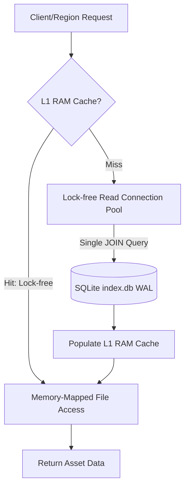

# Análise de Performance e Recomendações: Advanced Asset Module (AAS & AAC)

Este documento apresenta um diagnóstico detalhado dos gargalos de performance identificados no módulo **Advanced Asset** (compreendendo o `AdvancedAssetService` no servidor/Robust e o `AdvancedAssetCache` nas regiões) e propõe soluções de engenharia para otimizar a entrega de assets no OpenSimulator.

---

## 1. Diagnóstico dos Gargalos de Performance Atuais

A arquitetura atual baseada em **PackFiles** resolve com eficiência o problema de fragmentação de arquivos no sistema operacional. No entanto, o fluxo de leitura e entrega de assets possui quatro gargalos críticos que limitam a vazão (throughput) e aumentam a latência sob carga concorrente:

### A. Contenção de Lock Global no SQLite
Tanto no `PackFileManager.cs` quanto no `PackFileCache.cs`, todas as operações de leitura e escrita no banco de dados SQLite são protegidas por um lock exclusivo de nível de objeto (`lock (m_Lock)`). 
Como o SQLite utiliza uma única instância de `SQLiteConnection` (que não é thread-safe), o lock é obrigatório para evitar corrupção. Isso significa que **todas as requisições de leitura de metadados são serializadas**. Em uma grid ativa com múltiplas regiões e dezenas de usuários solicitando assets simultaneamente, as threads do servidor ficam enfileiradas aguardando a liberação do lock.

### B. Consultas SQL Redundantes (Falta de JOIN no AAS)
No `PackFileManager.GetAssetData`, o serviço executa duas consultas sequenciais ao banco de dados sob o lock exclusivo:
1. `GetMetadata(nid)`: Executa `SELECT hash, type, name, created, synced FROM asset_map WHERE uuid = :uuid`.
2. `GetIndexEntry(meta.Hash)`: Executa `SELECT pack_id, offset, length FROM index_assets WHERE hash = :hash`.

Isso gera duas viagens de ida e volta (roundtrips) ao banco de dados SQLite para cada leitura de asset, duplicando o tempo de processamento sob o lock.

### C. Ausência de Cache em Memória L1 (RAM Cache)
Não há um cache de metadados em memória RAM para os mapeamentos quentes (`UUID -> Metadados + Localização física`). Toda e qualquer requisição de entrega de asset precisa consultar o arquivo de banco de dados SQLite físico no disco (mesmo com o cache do SQLite ativo, o overhead da camada ADO.NET e do parser SQL é significativo). Como a esmagadora maioria dos assets no OpenSimulator é imutável, a falta de um cache de RAM L1 representa um desperdício de ciclos de CPU.

### D. Sobrecarga de I/O de Disco (Abertura/Fechamento de Handles)
Sempre que um asset é lido de um PackFile, o código abre um novo stream de arquivo, lê os bytes e fecha o stream:
```csharp
using (FileStream fs = new FileStream(packPath, FileMode.Open, FileAccess.Read, FileShare.ReadWrite))
using (BinaryReader br = new BinaryReader(fs)) { ... }
```
A criação frequente de handles de arquivos pelo sistema operacional (`FileStream`) introduz latência sistemática no sistema de arquivos, especialmente sob alta concorrência de leitura em discos rígidos ou SSDs sem enfileiramento otimizado.

---

## 2. Arquitetura de Entrega Otimizada (Proposta)

Para atingir a máxima performance de entrega, propõe-se uma arquitetura de fluxo de leitura livre de locks para assets em cache, combinada com acesso direto à memória para os arquivos de pacotes:



---

## 3. Soluções e Implementações Propostas

### Otimização 1: Cache L1 de Metadados em Memória (RAM Cache)
Implementar um cache em memória RAM usando um `ConcurrentDictionary` limitado (ou com política de evicção simples) para armazenar a localização física dos assets mais acessados. Isso permite que a maioria das requisições ignore completamente o SQLite e o lock global.

#### Esboço da Estrutura de Cache em C#:
```csharp
public class CachedAssetInfo
{
    public string Hash { get; set; }
    public sbyte Type { get; set; }
    public string Name { get; set; }
    public long Created { get; set; }
    public int PackFileID { get; set; }
    public long Offset { get; set; }
    public int Length { get; set; }
}

// No PackFileManager e PackFileCache:
private readonly ConcurrentDictionary<string, CachedAssetInfo> m_L1Cache = 
    new ConcurrentDictionary<string, CachedAssetInfo>(StringComparer.OrdinalIgnoreCase);
private const int MAX_CACHE_SIZE = 100000; // Limite de itens em memória
```

---

### Otimização 2: Consulta SQL Unificada via JOIN
Substituir as chamadas separadas de `GetMetadata` e `GetIndexEntry` por uma única consulta SQL utilizando `JOIN`. Essa abordagem já é parcialmente utilizada no `PackFileCache`, mas está ausente no `PackFileManager` do servidor.

#### Consulta SQL Otimizada:
```sql
SELECT am.hash, am.type, am.name, am.created, am.synced, ia.pack_id, ia.offset, ia.length
FROM asset_map am
LEFT JOIN index_assets ia ON am.hash = ia.hash
WHERE am.uuid = :uuid LIMIT 1
```

---

### Otimização 3: Conexões SQLite Multithread (Modo WAL + Connection Pool)
Em vez de compartilhar uma única conexão protegida por `lock(m_Lock)`, configurar o SQLite para operar em modo multithread nativo, utilizando uma conexão por thread ou um pool simples de conexões de leitura. O modo WAL (Write-Ahead Logging) do SQLite suporta múltiplos leitores simultâneos sem bloqueio mútuo.

#### Exemplo de Implementação de Conexão por Thread:
```csharp
[ThreadStatic]
private static SQLiteConnection t_ReadConnection;

private SQLiteConnection GetReadConnection()
{
    if (t_ReadConnection == null)
    {
        t_ReadConnection = new SQLiteConnection($"Data Source={m_IndexFile};Version=3;Cache Size=10000;");
        t_ReadConnection.Open();
        // Habilita otimizações locais da conexão de leitura
        using (var cmd = t_ReadConnection.CreateCommand())
        {
            cmd.CommandText = "PRAGMA journal_mode=WAL; PRAGMA synchronous=OFF; PRAGMA temp_store=MEMORY;";
            cmd.ExecuteNonQuery();
        }
    }
    return t_ReadConnection;
}
```
*Nota: Operações de escrita continuam serializadas pela fila de escrita em background existente, garantindo a integridade dos dados.*

---

### Otimização 4: Zero-Copy I/O com Memory-Mapped Files (MMF)
Em sistemas operacionais de 64 bits, a utilização de `MemoryMappedFiles` permite mapear os arquivos `.bin` de pacotes de assets diretamente no espaço de memória virtual do processo. Isso elimina a necessidade de abrir e fechar handles de arquivos a cada leitura, permitindo leituras paralelas concorrentes gerenciadas diretamente pelo cache de páginas do sistema operacional.

#### Exemplo de Cache de MMF para Leitura de Assets:
```csharp
using System.IO.MemoryMappedFiles;

private readonly ConcurrentDictionary<int, MemoryMappedFile> m_MappedPacks = 
    new ConcurrentDictionary<int, MemoryMappedFile>();

private MemoryMappedFile GetOrCreateMapping(int packId, string packPath)
{
    return m_MappedPacks.GetOrAdd(packId, pid => 
    {
        return MemoryMappedFile.CreateFromFile(
            packPath, 
            FileMode.Open, 
            $"AAS_Pack_{pid}", 
            0, 
            MemoryMappedFileAccess.Read
        );
    });
}

// Método de leitura física de dados do asset usando MMF:
public byte[] ReadAssetDataMMF(PackFileIndexEntry entry, string packPath)
{
    try
    {
        var mmf = GetOrCreateMapping(entry.PackFileID, packPath);
        
        // Abre um accessor para a região específica do asset dentro do arquivo grande
        using (var accessor = mmf.CreateViewAccessor(entry.Offset, entry.Length + 1024, MemoryMappedFileAccess.Read))
        {
            if (accessor.ReadUInt32(0) != MAGIC_NUMBER) return null;
            ushort version = accessor.ReadUInt16(4);
            
            // O offset dos dados depende do tamanho do cabeçalho
            long headerOffset = 4 + 2 + 16 + 1; // Magic + Version + UUID + Type
            if (version >= 2) headerOffset += 8; // CreatedDate
            
            ushort nameLen = accessor.ReadUInt16(headerOffset);
            headerOffset += 2 + nameLen; // NameLen + Name bytes
            
            int dataLen = accessor.ReadInt32(headerOffset);
            headerOffset += 4;
            
            byte[] data = new byte[dataLen];
            accessor.ReadArray(headerOffset, data, 0, dataLen);
            return data;
        }
    }
    catch (Exception ex)
    {
        m_log.Error($"[AAS]: MMF Read error for pack {entry.PackFileID}: {ex.Message}");
        return null;
    }
}
```

---

## 4. Plano de Implementação e Impacto Estimado

A tabela a seguir apresenta a estimativa de esforço de desenvolvimento e o impacto de cada otimização proposta:

| Otimização | Complexidade | Latência de Leitura (Estimada) | Vazão Concorrente (Throughput) |
| :--- | :--- | :--- | :--- |
| **Código Atual (Linha de Base)** | Alta Contenção | 5ms a 25ms (dependendo da fila) | Baixa (Serializada pelo lock) |
| **1. Cache L1 de RAM** | Baixa | < 0.1ms (L1 Hit) | Altíssima (Livre de lock) |
| **2. JOIN SQL Unificado** | Baixa | ~ 1.5ms (L1 Miss) | Média (Reduz queries pela metade) |
| **3. SQLite Multithread (WAL)** | Média | ~ 1.0ms (L1 Miss) | Alta (Leituras paralelas no DB) |
| **4. Memory-Mapped Files** | Média-Alta | ~ 0.2ms (L1 Miss) | Altíssima (I/O concorrente direto) |

### Recomendações de Curto Prazo (Vitórias Rápidas):
1. **Implementar a Consulta JOIN no AAS:** Alinha o `PackFileManager` com a estrutura otimizada que o cache regional já utiliza.
2. **Adicionar o Cache L1 (RAM):** O cacheamento de metadados em RAM é de simples implementação e reduzirá imediatamente as consultas de banco de dados para mais de 90% das requisições repetidas.
